<p align="center">
  
</p>

<p align="center">
  <a href="https://www.sentinels.in/"><strong>Live · sentinels.in</strong></a>
  &nbsp;&nbsp;·&nbsp;&nbsp;
  <a href="#the-thesis-crm-is-the-permission-layer"><strong>The thesis</strong></a>
  &nbsp;&nbsp;·&nbsp;&nbsp;
  <a href="#architecture"><strong>Architecture</strong></a>
  &nbsp;&nbsp;·&nbsp;&nbsp;
  <a href="#run-locally"><strong>Run locally</strong></a>
</p>

<p align="center">
  
  
  
  
  
  
  
</p>

---

## The problem

Every revenue-intelligence tool runs on the same fuel: the conversations around a deal — email, calendar invites, chat. That's also the most sensitive data a company holds. So the first real question isn't "what model scores the deal," it's "what are we even allowed to read?" Most tools treat that as an afterthought, and it surfaces as one of two failure modes.

One: ingest everything. Connect a mailbox, pull every thread, read the whole Slack workspace. You get great coverage and a surveillance liability — employees' private messages, vendor negotiations, HR threads, all sitting in a third-party database with no principled boundary. Security review kills the deal, or should.

Two: ingest nothing useful. Make the user tag each thread by hand, or limit ingestion to a manually-maintained allowlist. Safe, and dead within a month — nobody maintains it, coverage rots, and the product degrades into a worse CRM.

Sentinel takes neither. It binds ingestion to a boundary the business already maintains and already trusts: the CRM.

---

## The thesis: CRM is the permission layer

A CRM contact book isn't just a list of people. It's an organization's standing answer to "who are we in a business relationship with." Sales already curate it, dedupe it, and keep it current — their job depends on it. That makes it the right ACL for data ingestion, and it's already being maintained for free.

So the rule is simple and absolute: **a message is ingested only if at least one participant matches a Contact synced from a connected CRM.** An email whose sender and recipients are all strangers is dropped. A Slack message from someone not in the book is dropped. A calendar event with no CRM attendee is dropped. The check runs on every inbound item — after self-exclusion (the user's own address never counts) and email normalization — against a `Contact` table populated by read-only HubSpot and Salesforce sync.

This beats the alternatives on every axis that matters. Manual allowlists drift and demand maintenance nobody does. Domain allowlists (`@acme.com`) over-admit — they pull in a prospect's entire company, including people you've never dealt with. Shared-secret or header gates authenticate the *sender*, not the *relationship* — they prove a message really came from Acme, not that Acme is someone you're allowed to track. CRM membership is the only gate that's self-maintaining and actually models the business relationship.

It is also fail-closed. The permission check (`src/lib/crm-permission.ts`) returns "not in book" on any database error rather than admitting data it couldn't verify — a backend hiccup can never silently widen the ingestion boundary. And it is PII-blind: the filter logs outcome counts and a fixed enum of reason tokens (`passed`, `dropped_no_crm_match`, `dropped_self_user`, `fail_closed`), never an email address or message body.

---

## Architecture

<p align="center">
  
</p>

> **Read-only in, gated, persisted or dropped.** CRM sync (HubSpot / Salesforce) populates the `Contact` book; every inbound Gmail / Calendar / Slack message is checked against it, and only messages with a CRM-matched participant are stored.

CRM sync populates the `Contact` table — read-only; Sentinel never writes back. Each inbound message from Gmail, Calendar, or Slack has its participant emails checked against that table in a single batched query that rides the `@@unique([userId, email])` index. On a match, the message is persisted with the matched contact IDs attached and an outcome of `passed`; otherwise only a metric is incremented. The gate is the product, not a feature — it's enforced in every source's ingestion path.

_End-to-end verification:_ [`docs/verify-crm-permission-filter.md`](./docs/verify-crm-permission-filter.md) is the manual runbook — sync a real inbox, then prove with SQL that no message lacking a CRM participant ever reaches the database.

---

## Why this is hard

The thesis is one function. Making it hold up in production is the work.

- **Three OAuth providers, three token-expiry models.** Slack bot tokens don't expire, so there's nothing to refresh. HubSpot issues a short-lived access token plus a refresh token, with the server's expiry stored per integration (`tokenExpiresAt`). Salesforce's token response carries no `expires_in` at all — so the access token is treated as lifetime-based and cached for a fixed 110-minute window with a safety buffer, then refreshed. One code path, three different truths about when a credential goes stale.
- **HMAC verification under clock skew.** Slack signs each request over `v0:timestamp:rawBody`. Verification must use the *raw* bytes (a `JSON.parse`/`stringify` round-trip changes the digest), reject anything outside a 300-second replay window, and compare with `timingSafeEqual` after a length pre-check — because `timingSafeEqual` throws on unequal-length buffers.
- **Idempotent ingestion under at-least-once delivery.** Slack retries events; the same `event_id` can arrive several times, sometimes concurrently. Dedup is a `@@unique([userId, slackEventId])` index plus a cheap pre-check, with a `P2002` catch on insert to absorb the race where two retries pass the pre-check at once. Gmail uses `@@unique([userId, externalId, source])`.
- **CRM contact-set drift.** Admission is decided at ingest time, not re-evaluated forever. If a Contact is deleted after a message was stored, that message keeps the contact IDs it matched at the time — history doesn't rewrite itself when the book changes. The boundary governs what enters, not a retroactive filter on what's already in.
- **Secrets at rest with a rotation story.** Bearer tokens for five providers live in the database. They're encrypted with a versioned envelope so the format and key can evolve without a migration that assumes plaintext.

---

## Design decisions & tradeoffs

**Read-only OAuth scopes.** *Why:* Gmail and Calendar use `gmail.readonly` / `calendar.readonly`, and the CRM scopes are read-only too. Sentinel cannot modify a customer's inbox, calendar, or CRM, which shrinks the blast radius of a compromise and makes the consent screen honest. *Tradeoff accepted:* no auto-creating Contacts and no writing scores back into the CRM — enrichment is one-directional.

**Per-integration encrypted token storage.** *Why:* tokens are bearer credentials; TLS protects them in transit but not at rest, so each secret is stored as an AES-256-GCM envelope. *Tradeoff accepted:* more moving parts than plaintext-plus-TLS, and a key that must be present for any integration to function.

**CRM membership as the gate.** *Why:* self-maintaining, and it models the real relationship (above). *Tradeoff accepted:* a prospect not yet added to the CRM is invisible — coverage is only as good as the book. A boundary that under-admits beats one that over-admits.

**HMAC-signed, stateless OAuth state.** *Why:* the HubSpot and Salesforce flows carry CSRF state in an HMAC-signed cookie (`src/lib/signed-cookies.ts`) verified with `timingSafeEqual`, so there's no server-side session store to run and a forged cookie can't swap the userId mid-flow. *Tradeoff accepted:* shared-secret management, and the Gmail/Calendar flows still use plain JSON state cookies — signing them is a known, deliberate follow-up.

**Risk recomputed on read.** *Why:* deal risk is derived from timeline events on each read, with auditable reason strings, so there's no stale precomputed score to invalidate. *Tradeoff accepted:* cost grows with pipeline size; very large pipelines would need precomputation or caching.

---

## Failure modes

- **Slack token revoked or `users.info` rate-limited.** The email resolver throws; the handler fails closed, drops the event with a `fail_closed` metric, and persists nothing. Dropping one message beats admitting one we couldn't validate.
- **Provider rate limits / transient 5xx.** External calls go through retry-with-backoff and a per-provider circuit breaker (`retry.ts`, `circuit-breaker.ts`, `reliable-fetch.ts`); an open circuit short-circuits instead of hammering a degraded provider.
- **Partial failure mid-sync.** Syncs upsert by external ID, so a re-run is idempotent and a half-finished sync leaves no duplicates. Each provider emits structured completion metrics.
- **Postgres connection-pool exhaustion.** The app uses the pooled Supabase URL (`DATABASE_URL`, port 6543, pgbouncer); migrations use the direct URL (`DIRECT_URL`, port 5432). The permission check fails closed on any DB error, so pool pressure degrades to dropped ingestion — never to over-admission.
- **Duplicate event / webhook delivery.** Unique indexes plus `P2002` handling collapse retries to a `duplicate_event` outcome with no double-write.

---

## Security model

- **Secrets at rest.** AES-256-GCM, envelope format `enc:v1:<iv>:<tag>:<ciphertext>` with a random 96-bit IV per secret and the GCM auth tag stored inline (`src/lib/integration-secrets.ts`). The key is a single 32-byte KEK from `INTEGRATION_ENCRYPTION_KEY` (base64); legacy plaintext rows still decrypt for backward compatibility. The `v1` prefix exists so the format or key can be rotated later (see *Not built yet*).
- **HMAC in three places.** Inbound Slack requests are signature-verified with a 300-second replay window; OAuth state cookies are HMAC-signed and `timingSafeEqual`-checked; outbound webhooks are signed with an `X-Webhook-Signature` (HMAC-SHA256) header so receivers can verify authenticity (`src/lib/webhooks.ts`).
- **Read-only and private.** Read-only OAuth scopes; Sentinel never writes back to a connected system; pipeline data is never used to train shared models; the permission filter never logs message text or participant emails.

---

## Tech stack

Next.js 16 · React 19 · TypeScript · Prisma · PostgreSQL / Supabase (pooled `6543` / direct `5432`) · Clerk · Upstash Redis · OpenRouter · Sentry.

---

## What's intentionally not built yet

Scope discipline, stated plainly:

- **Multi-workspace tenancy.** Single-installer model today — one operator, their CRM, their sources. Team tenancy is an isolation problem worth doing once, against a real multi-seat customer.
- **Public app distribution.** The OAuth apps run in development/test distribution mode and Google OAuth verification is deferred — gating work I'd rather do against real customer traffic than speculatively.
- **Per-integration key derivation and rotation.** One KEK encrypts all secrets today; the versioned envelope leaves room for per-integration derived keys and an automated rotation routine when the threat model warrants it.
- **Async webhook-delivery retry queue.** Delivery is synchronous with structured logging — sufficient at current volume; a durable retry queue is the next step when volume justifies it.

---

## Run locally

```bash
git clone https://github.com/parbhatkapila4/Sentinel.git
cd Sentinel
npm install
cp .env.example .env.local      # fill in the required vars below
npx prisma generate
npx prisma migrate dev
npm run dev                      # http://localhost:3000
```

Required: `DATABASE_URL` + `DIRECT_URL`, Clerk keys, `OPENROUTER_API_KEY`, `INTEGRATION_ENCRYPTION_KEY` (32-byte base64), and `GOOGLE_OAUTH_CLIENT_ID` / `GOOGLE_OAUTH_CLIENT_SECRET` for the Gmail and Calendar flows. OAuth-exchange and callback behavior is covered by suites under `src/app/api/oauth/**/__tests__`, `src/app/api/integrations/**/oauth/__tests__`, and `src/lib/__tests__/google-oauth.test.ts`. `npm run verify` runs typecheck, lint, and the full Vitest suite.

---

## About

Built by Parbhat Kapila — full-stack engineer focused on production AI systems. More at [parbhat.dev](https://parbhat.dev).

---

## Pricing

Pricing is included below to keep the landing-page pricing and README in sync (enforced by `pricing-drift.test.ts`). Skip if you're here to read code.

Source of truth: `src/lib/pricing-catalog.ts`.

- `Starter`: **$0/month**
- `Professional`: **$31/month** (or **$20/month** annual billing)
- `Enterprise`: **$85/month** (or **$56/month** annual billing)

PayPal checkout links:

- `pro.monthly` → https://www.paypal.com/ncp/payment/VMD5RE6KLUJUE
- `pro.annual` → https://www.paypal.com/ncp/payment/ZVFF5ALD7ZYMJ
- `enterprise.monthly` → https://www.paypal.com/ncp/payment/X6JYZYK6WBRBA
- `enterprise.annual` → https://www.paypal.com/ncp/payment/RD8DBKTWRS8EY
